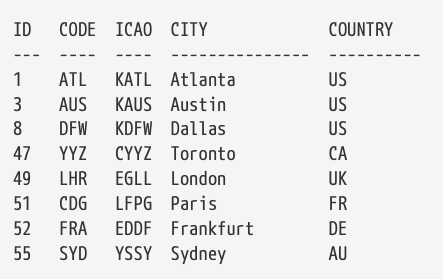
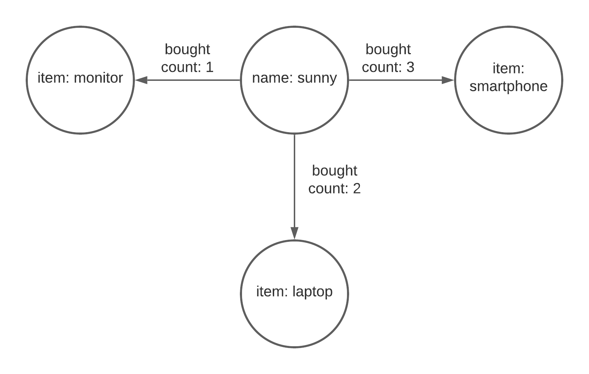

# Gremlin and SQL
In graph databases, data is represented as vertices (equivalent to rows in a SQL table) and edges 
(the relationships between rows in different tables). A key difference is that relationships are first-class citizens in
graph databases, directly stored and efficiently traversed, unlike foreign keys and join operations in relational
databases. All graph traversals start with either a g.V() or a g.E().

- Vertices and Edges: Think of vertices as your data records and edges as the relationships between these records.
- Traversal: Moving from one vertex to another through edges. It's akin to navigating through foreign key relationships but more flexible and powerful.
- Filters and Conditions: Similar to WHERE clauses in SQL, but applied while traversing the graph.
- Projection: Selecting specific properties of vertices or edges, similar to choosing columns in an SQL query.

## SQL to Gremlin Analogies
Here are some analogies to translate SQL concepts to Gremlin:

- **SELECT**: In SQL, you select rows from a table. In Gremlin, you start a traversal (g.V(), g.E() for vertices and edges, respectively) and filter/select vertices or edges.
- **WHERE**: Filtering is done in Gremlin using steps like has(), hasLabel(), and where() which are analogous to SQL's WHERE clause.
- **JOIN**: Graph databases naturally represent relationships, so you don't need explicit JOINs. Traversing from one vertex to another via edges is inherently a "join" operation.

## SQL 
**SQL Table**
- Airport table by country



## Select
SQL query to count the distribution of airports in each country as follows.
```sql
select country,count(country) from airports group by country;
```

We can do this in Gremlin using the air-routes graph
```gremlin
g.V().hasLabel('airport').groupCount().by('country')
#OR
g.V().hasLabel('airport').group().by('country').by(count())
```

- Air routes table
Graph databases are usually a good choice for storing and modelling networks. The air-routes graph is an example of a network graph.
```text
SRC  DEST  DIST
  ---  ----  ----
  ATL  DFW   729
  ATL  FRA   4600
  AUS  DFW   190
  AUS  LHR   4901
  BOM  AGR   644
  BOM  LHR   4479
  CDG  DFW   4933
  CDG  FRA   278
  CDG  LHR   216
  DFW  FRA   5127
  DFW  LHR   4736
  LHR  BOM   4479
  LHR  FRA   406
  YYZ  FRA   3938
  YYZ  LHR   3544
```
If we wanted to write a SQL query to calculate the ways of travelling from Austin (AUS) to Agra (AGR) with two stops, we would end up writing a query that looked something like this:
```sql
select a1.code,r1.dest,r2.dest,r3.dest from airports a1
    join routes r1 on a1.code=r1.src
    join routes r2 on r1.dest=r2.src
    join routes r3 on r2.dest=r3.src
where a1.code='AUS' and r3.dest='AGR';
```

Using our air-routes graph database the query can be expressed quite simply as follows:
```gremlin
g.V().has('code','AUS').out().out().out().has('code','AGR').path().by('code')
```

We could use repeat to express the concept of three times as follows. Gremlin also has a repeat ... until construct
```gremlin
g.V().has('code','AUS').repeat(out()).times(3).has('code','AGR').path().by('code')
```

- Selecting All Vertices or Rows
This Gremlin query fetches all vertices from the graph, which is analogous to selecting all rows from a table in SQL.
```gremlin
// SELECT * FROM users;
g.V();
```

## Filtering Based on a Property
Here, has is used to filter vertices that have an 'age' property greater than 30, similar to the WHERE clause in SQL.
```gremlin
// SELECT * FROM users WHERE age > 30;
g.V().has('age', gt(30));

// SELECT * FROM users WHERE id = 1;
g.V().has('users','id',1).valueMap()

```

## Joining Tables vs. Traversing Edges
In Gremlin, rather than joining tables, you traverse edges from one vertex to another. This query finds users who 
have placed orders with a total greater than 100.
```gremlin
// SELECT users.* FROM users JOIN orders ON users.id = orders.user_id WHERE orders.total > 100;
g.V().hasLabel('user').out('placedOrder').has('total', gt(100)); // assuming 'placedOrder' is the edge connecting users to orders
```
Finds all 'user' vertices over age 30 and traverses the 'placedOrder' edges to the related 'order' vertices. The 
concept of JOIN is naturally represented by traversing edges.
```gremlin
// SELECT * FROM users JOIN orders ON users.id = orders.user_id WHERE users.age > 30
g.V().hasLabel('user').has('age', gt(30)).out('placedOrder')
```


## Aggregations
Aggregations like COUNT are straightforward in both SQL and Gremlin, with Gremlin queries often being more concise.

```gremlin
// SELECT COUNT(*) FROM users WHERE age > 30;
g.V().has('age', gt(30)).count();
```

## Subquery
```gremlin
// SELECT * FROM users WHERE user_id IN (SELECT user_id FROM orders WHERE order_date = '2023-01-01');
// assuming 'placedOrder' is the edge connecting users to orders
g.V().hasLabel('orders').has('order_date', '2023-01-01').in('placedOrder').dedup()

```


## Grouping and Aggregation
Gremlin allows grouping and aggregating through the group() step, which is flexible and powerful for aggregating 
properties or counts by specific keys.

```gremlin
// SELECT department, COUNT(*) FROM employees GROUP BY department;
g.V().hasLabel('employee').group().by('department').by(count());
```

## Retrieving property values from a vertex
```gremlin
// What property values are stored in the DFW vertex?
g.V().has('airport','code','DFW').values()

// The values step can take parameters that tell it to only return the values for the provided key names. 
// Return just the city name property
g.V().has('airport','code','DFW').values('city')

// Return the 'city' and 'icao' property values.
g.V().has('airport','code','DFW').values('city','icao')

```

## Does a specific property exist on a given vertex or edge?

```gremlin
// Find all edges that have a 'dist' property
g.E().has('dist')
// Find all vertices that have a 'region' property
g.V().has('region')
// Find all the vertices that do not have a 'region' property
g.V().hasNot('region')
// The above is shorthand for
g.V().not(has('region'))
```

## Counting things
```gremlin
// How many airports are there in the graph?
 g.V().hasLabel('airport').count()
 
// How many routes are there?
g.V().hasLabel('airport').outE('route').count()  

// How many routes are there? This should return the same count as above.
g.E().hasLabel('route').count()
```

## Counting groups of things
```gremlin
// How many of each type of vertex are there?
g.V().groupCount().by(label)
// OR  How many of each type of vertex are there?
g.V().label().groupCount()
// As above but using group()
g.V().group().by(label).by(count())
// array of label types
g.V().label().dedup()

   
// How many of each type of edge are there?
g.E().groupCount().by(label)
g.E().label().groupCount() 
```


```groovy
// How many airports are there in each country?
g.V().hasLabel('airport').groupCount().by('country')
// How many airports are there in each country? (look at country first)
g.V().hasLabel('country').group().by('code').by(out().count())

// How many airports are there in each continent?
g.V().hasLabel('continent').group().by('code').by(out().count())

// How many airports are there in France (having first counted all countries)
g.V().hasLabel('airport').groupCount().by('country').select('FR')

// How many airports are there in France, Greece and Belgium respectively?
g.V().hasLabel('airport').groupCount().by('country').select('FR','GR','BE')
  
```

```gremlin
// Where can I fly to from Austin?
g.V().has('airport','code','AUS').out().values('code').fold()
// or
g.V().has('airport','code','AUS').out('route').values('code').fold()
#output
//  [YYZ, LHR, FRA, MEX, PIT, PDX, CLT, CUN, MEM, CVG, IND, MCI, DAL, STL, ABQ, MDW, LBB,
//   HRL, GDL, PNS, VPS, SFB, BKG, PIE, ATL, BNA, BOS, BWI, DCA, DFW, FLL, IAD, IAH, JFK,
//   LAX, MCO, MIA, MSP, ORD, PHX, RDU, SEA, SFO, SJC, TPA, SAN, LGB, SNA, SLC, LAS, DEN,
//   MSY, EWR, HOU, ELP, CLE, OAK, PHL, DTW]

```

## Adjacent, Incident
One vertex is considered to be **adjacent** to another vertex if there is an edge connecting them. A vertex
and an edge are considered **incident** if they are connected to each other.

| Name   | Description                                      |
|:-------|:-------------------------------------------------|
| out*   | Outgoing adjacent vertices.                      |
| in*    | Incoming adjacent vertices.                      |
| both*  | Both incoming and outgoing adjacent vertices.    |
| outE*  | Outgoing incident edges.                         |
| inE*   | Incoming incident edges.                         |
| bothE* | Both outgoing and incoming incident edges.       |
| outV   | Outgoing vertex.                                 |
| inV    | Incoming vertex.                                 |
| otherV | The vertex that was not the vertex we came from. |


### out() vs. outE()


In the graph above, we have four vertices and three edges. The vertex in the middle with the property "name": "sunny" is
the vertex from where we'll start our traversal. The other three vertices are the items that I bought from an e-commerce
website. They are a smartphone, a laptop, and a monitor. The relationship is represented with edges labelled bought.

The edges have another property called count, and as you can tell, they represent the number of times I have bought
these items. So I bought three smartphones, two laptops, and one monitor.

Get a reference to our starting vertex with the following query:
```gremlin
sunny = g.V().has('name', 'sunny').next()
```

We know that we use the outE(), an outgoing incident edge, to traverse an edge that is going out of the current vertex.
We pass in the label- **bought** of one or more edges to the function. If I want to get all the items
that I have bought, I’ll run the following query:

```gremlin
g.V(sunny).outE('bought').in()
```
Above will give all the items brought by sunny.

But you can also use the following query for the same use case:
```gremlin
g.V(sunny).out('bought')
```
When you’re using the outE().in() combination, you can simply replace it with out(). It's a shorthand or an alias for
the long form outE().in(). But then, why would you use outE() at all?

Suppose you want to filter or limit the traversal based on other properties of the edge. For example, in our sample
graph, I want to get only the items that have bought more than once. We have the count property for each of our bought
edge. We can use that to filter our vertices. For this, the query is as follows:

```gremlin
g.V(sunny).outE('bought').has('count', gt(1)).inV()
```

As you can see, we can use the has() function on edges as well to filter out edges with particular property. This
ability to filter is not available when you use the out() function. Because the result of the out() function is
vertices. So if you call the has() function on that result, you'll be filtering on the vertices and not edges.

### in() vs. inE()
It’s the same story with the in() and inE() functions as well. If you want to filter edges based on extra properties,
you use the inE() function instead of in().

## What vertices and edges did I visit? - Introducing path
 After you have done some graph walking using a query you can use path to get a summary back of where you went
 
This following query will return the vertices and outgoing edges starting at the London City (LCY) airport vertex. 
You can read this query like this: "Start at the LCY vertex, find all outgoing edges and also find all of the vertices
that are on the other ends of those edges". The inV step gives us the vertex at the other end of the outgoing edge.


```groovy// This time, for each route, return both vertices and the edge that connects them.
g.V().has('airport','code','LCY').outE().inV().path()
// output a buch of items like below
[v[88],e[13698][88-route->77],v[77]]
```
While this result is useful, we might want to return something more human readable such as the IATA codes for each airport 
and perhaps the distance property from the edge that tells us how far apart the airports are.

## by modulators

```groovy
  g.V().has('airport','code','LCY').outE().inV().
        path().by('code').by('dist')
// output
[LCY,456,GVA]

// above query and following query are same
  g.V().has('airport','code','LCY').outE().inV().
        path().by('code').by('dist').by('code')
```
The **by modulator** steps are processed in a round robin fashion. If there are not enough modulators specified for the 
total number of elements in the path, Gremlin just loops back around to the first by step and so on. _So **even though there
were three elements in the path** that we wanted to have formatted, we only needed to specify two by modulators. This is 
because the first and third elements in the path are of the same type, namely airport vertices, and we wanted to use the
same property name, code, in each of those cases._ **If we instead wanted to reference a different property name for each 
element of the path result, we would need to specify three explicit by modulator steps.** This would be required if, 
for example, we wanted to reference the city property of the third element in the path rather than its code.

```groovy
 g.V().has('airport','code','LCY').outE().inV().
       path().by('code').by('dist').by('city')
 //output
 [LCY,456,Geneva]       
        
```

Sometimes it is necessary to use a **by modulator that has no parameter** as shown below. This is because the element in the 
path is not a vertex or edge containing multiple properties but rather a single value, in this case, an integer.

```groovy
g.V().has('airport','code','LCY').out().limit(5).
        values('runways').
path().by('code').by('code').by()

// The results show the codes for the airports we visited along with a number representing the
// number of runways the second airport has.
// result
// [LCY,AGP,2]
// [LCY,ABZ,4]
// [LCY,JER,1]
// [LCY,BSL,2]
// [LCY,BHD,1]
```

## anonymous traversals
It is also possible to use a traversal inside of a by modulator. Such traversals are known as **"anonymous traversals**" 
as they do not include a beginning V or E step.
This capability allows us to do things like combine multiple values together as part of a path result. The example 
below finds five routes that start in Austin and creates a path result containing the airport code and city name for
both the source and destination airports. In this case, the anonymous traversal contained within the by modulator is 
applied to each element in the path.

```gremlin
g.V(3).out().limit(5).path().by(values('code','city').fold())
// Result
// [[AUS,Austin],[YYZ,Toronto]]
// [[AUS,Austin],[LHR,London]]
// [[AUS,Austin],[FRA,Frankfurt]]
// [[AUS,Austin],[MEX,Mexico City]]
// [[AUS,Austin],[PIT,Pittsburgh]]
```

## Modifying a path using from and to modulators
The following query  returns the first 10 routes found starting at Austin (AUS) with one stop on the way.
```gremlin
g.V().has('airport','code','AUS').out().out().path().by('code').limit(10)
[AUS,EWR,YYZ]
  [AUS,EWR,YVR]
  [AUS,EWR,LHR]
  [AUS,EWR,CDG]
  [AUS,EWR,FRA]
  [AUS,EWR,NRT]
  [AUS,EWR,DEL]
  [AUS,EWR,DUB]
  [AUS,EWR,HKG]
  [AUS,EWR,PEK]
```

Given that every journey starts in Austin, we might not actually want the AUS airport code to be part of the returned results. 
We might just want to capture the places that we ended up visiting after leaving Austin. This can be achieved by l**abelling 
the parts of the traversal** that we care about using as steps and then using from and to modulators to tell the path step
what we are interested in.

```gremlin
g.V().has('airport','code','AUS').out().as('a').out().as('b').
        path().by('code').from('a').to('b').limit(10)
# AUS is not included in the path results.
[EWR,YYZ]
  [EWR,YVR]
  [EWR,LHR]
  [EWR,CDG]
  [EWR,FRA]
  [EWR,NRT]
  [EWR,DEL]
  [EWR,DUB]
  [EWR,HKG]
  [EWR,PEK]
```
Because after skipping the AUS part of the path we did in fact want the rest of the results **we could have left off the 
to modulator** and written the query as follows.

```gremlin
 g.V().has('airport','code','AUS').out().as('a').out().
        path().by('code').from('a').limit(10)
[EWR,YYZ]
  [EWR,YVR]
  [EWR,LHR]
  [EWR,CDG]
  [EWR,FRA]
  [EWR,NRT]
  [EWR,DEL]
  [EWR,DUB]
  [EWR,HKG]
  [EWR,PEK]

```


## Does an edge exist between two vertices?
You can use the hasNext step to check if an edge exists between two vertices and get a Boolean (true or false) value back.
first query below will return true because there is an edge (a route) between AUS and DFW. The second query will return false because 
there is no route between AUS and SYD.
```groovy
g.V().has('code','AUS').out('route').has('code','DFW').hasNext()
// true

 g.V().has('code','AUS').out('route').has('code','SYD').hasNext()
// false
```

##  Using as, select and project to refer to traversal steps
Sometimes it is useful to be able to remember a point of a traversal by giving it a name (label) and refer to it later
on in the same query. The query below uses an as step to attach a label at two different parts of the traversal, each 
representing different vertices that were found. A select step is later used to refer back to them.
```gremlin
g.V().has('code','DFW').as('from').out().
        has('region','US-CA').as('to').
        select('from','to')
// result
// [from:v[8],to:v[13]]
// [from:v[8],to:v[23]]
// [from:v[8],to:v[24]]
// ..        
```

We can also use a by modulator to specify which property to retrieve from the selected vertices.

```gremlin
 g.V().has('code','DFW').as('from').out().
        has('region','US-CA').as('to').
        select('from','to').by('code')
        
 //result
 [from:DFW,to:LAX]
  [from:DFW,to:SFO]
  [from:DFW,to:SJC]
  ...       
```
here is the same query but using path. 
```gremlin
  g.V().has('code','DFW').out().
        has('region','US-CA').
path().by('code')
//result
[DFW,LAX]
  [DFW,ONT]
  [DFW,PSP]
  ...

```

>> While the path step is a lot more convenient, in some cases it can be very expensive in terms of memory and CPU usage so it is worth remembering these alternative techniques using as and select. 

## project

```text
 g.V().has('type','airport').limit(10).as('a','b','c').
        select('a','b','c').
          by('code').by('region').by(out().count())
  OR        
 g.V().has('type','airport').limit(10).
        project('a','b','c').
by('code').by('region').by(out().count())

// result
[a:ATL,b:US-GA,c:232]
  [a:ANC,b:US-AK,c:39]
  [a:AUS,b:US-TX,c:59]
  ...
OR
 g.V().has('type','airport').limit(10).
         project('IATA','Region','Routes').
  by('code').by('region').by(out().count())

//REsult
 [IATA:ATL,Region:US-GA,Routes:232]
  [IATA:ANC,Region:US-AK,Routes:39]
  [IATA:AUS,Region:US-TX,Routes:59]
  [IATA:BNA,Region:US-TN,Routes:55]
  ...

```

## Using multiple as steps with the same label
It is actually possible using an as step to give more than one part of a traversal the same label (name). In the example below, the label 'a' is used twice but 
you will notice that when the label is selected only the last item added is returned. here are some special keywords that 
can be used in conjunction with the select step in cases like this one. These keywords are first, last and all and their usage is shown below.

```gremlin
  g.V(1).as('a').V(2).as('a').select('a')
  v[2]
  g.V(1).as('a').V(2).as('a').select(first,'a')
  v[1]
  g.V(1).as('a').V(2).as('a').select(last,'a')
  v[2]
  g.V(1).as('a').V(2).as('a').select(all,'a')
  [v[1],v[2]]
```

Here is another example of a query that labels two different parts of a traversal with the same 'a' label. As you can 
see from the results, only the second one is used because of the last keyword that is provided on the select step.

```gremlin
g.V().has('code','AUS').as('a').
        out().as('a').limit(10).
        select(last,'a').by('code').fold()
 //Reult       
[YYZ,LHR,FRA,MEX,PIT,PDX,CLT,CUN,MEM,CVG]
```

Here is the same query but using the first keyword this time as part of the select step.
```gremlin
  g.V().has('code','AUS').as('a').
        out().as('a').limit(10).
        select(first,'a').by('code').fold()
  [AUS,AUS,AUS,AUS,AUS,AUS,AUS,AUS,AUS,AUS]
```

Note that when the same name is used to label a step, the data structure created by Gremlin is essentially a List. As such, 
the by modulator cannot be used when the all keyword is used on the select step. To get the values of each element in the list we can use an unfold step as shown below.
```gremlin
g.V().has('code','AUS').as('a').
        out().as('a').limit(10).
        select(all,'a').unfold().values('code').fold()
  [AUS,AUS,AUS,AUS,AUS,AUS,AUS,AUS,AUS,AUS,
   YYZ,LHR,FRA,MEX,PIT,PDX,CLT,CUN,MEM,CVG]

```

## Limit

```gremlin
  // Only return the FIRST 20 results
  g.V().hasLabel('airport').values('code').limit(20)
  // Only return the LAST 20 results
  g.V().hasLabel('airport').values('code').tail(20)
  
    // Only return the FIRST 20 results
  g.V().hasLabel('airport').range(0,20).values('code')

```
We can also limit a traversal by specifying a maximum amount of time that it is allowed to run for. The following query 
is **restricted to a maximum limit of ten milliseconds**. The query looks for routes from Austin (AUS) to London Heathrow (LHR). 
```gremlin
// Limit the query to however much can be processed within 10 milliseconds
  g.V().has('airport','code','AUS').
        repeat(timeLimit(10).out()).until(has('code','LHR')).path().by('code')

```

## Removing duplicates - introducing dedup
It is often desirable to remove duplicate values from query results. The **dedup** step allows us to do this.

The number of runways for every airport in England is queried. Note that in the returned results there are many duplicate values.
```gremlin
  g.V().has('region','GB-ENG').values('runways').fold()
  // [2,2,2,1,1,1,1,1,1,1,1,1,1,1,1,2,1,2,2,1,3,1,3,3,4,1,1]
```
If we only wanted a set of unique values in the result we could rewrite the query to include a dedup step.
```gremlin
  g.V().has('region','GB-ENG').values('runways').dedup().fold()
  //[2,1,3,4]
  
  g.V().has('region','GB-ENG').dedup().by('runways').
        values('code','runways').fold()
  //[LHR,2,LCY,1,BLK,3,LEQ,4]
  
  
  g.V(3).as('a').V(4).as('c').both().as('b').limit(10).
    select('a','b','c')
  //Result
  [a:v[3],b:v[1],c:v[4]]
  [a:v[3],b:v[3],c:v[4]]
  [a:v[3],b:v[5],c:v[4]]
  [a:v[3],b:v[6],c:v[4]]
  [a:v[3],b:v[7],c:v[4]]
  [a:v[3],b:v[8],c:v[4]]
  [a:v[3],b:v[9],c:v[4]]
  [a:v[3],b:v[10],c:v[4]]
  [a:v[3],b:v[11],c:v[4]]
  [a:v[3],b:v[12],c:v[4]]
  //Result
  g.V(3).as('a').V(4).as('c').both().as('b').limit(10).
    dedup('a','c').select('a','b','c')
  [a:v[3],b:v[1],c:v[4]]  
  
```
## valueMap to explore the properties of a vertex or edge
A call to valueMap will return all of the **properties of a vertex or edge as an array of key:value pairs. Basically what
in Java terms is called a HashMap.** You can also select which properties you want valueMap to return if you do not want
them all. Each element in the map can be addressed using the name of the key. _By default the ID and label are not 
included in the map unless a parameter of true is provided._

The query below will return the keys and values for all properties associated with the Austin airport vertex. The unfold 
step at the end of the query is used to make the results easier to read.

```gremlin
  // Return all the properties and values the AUS vertex has
  g.V().has('code','AUS').valueMap().unfold()
  
//Result
 country=[US]
  code=[AUS]
  longest=[12250]
  city=[Austin]
  elev=[542]
  icao=[KAUS]
  lon=[-97.6698989868164]
  type=[airport]
  region=[US-TX]
  runways=[2]
  lat=[30.1944999694824]
  desc=[Austin Bergstrom International Airport] 

  // If you also want the ID and label, add a parameter of true
  g.V().has('code','AUS').valueMap(true).unfold()
  
  //Result
  id=3
  label=airport
  country=[US]
  code=[AUS]
  longest=[12250]
  city=[Austin]
  elev=[542]
  icao=[KAUS]
  lon=[-97.6698989868164]
  type=[airport]
  region=[US-TX]
  runways=[2]
  lat=[30.1944999694824]
  desc=[Austin Bergstrom International Airport]
```
You can also mix use of true along with requesting the map for specific properties. The next example will just return 
the ID, label and region property.
```gremlin
  // If you want the ID, label and a specific field like the region, you can do this
  g.V().has('code','AUS').valueMap(true,'region')
  //Result
  [id:3,region:[US-TX],label:airport]
```

>> If you only need the keys and values for specific properties to be returned it is recommended to pass the names of
> those properties as parameters to the valueMap step so it does not return a lot more data than you need. 
> Think of this as the difference, in the SQL world, between selecting just the columns you are interested 
> in from a table rather than doing a SELECT *.
> 

```gremlin
g.V().has('code','AUS').valueMap(true,'code','icao','desc','city').unfold()
//Result
  code=[AUS]
  city=[Austin]
  icao=[KAUS]
  id=3
  label=airport
  desc=[Austin Bergstrom International Airport]

```

### WithOptions.tokens
Instead of using valueMap(true) to include the ID and label of an element (**a vertex or an edge**) in the results, 
the new with(WithOptions.tokens) construct can now be used as shown below.

```gremilin
.V().has('code','SFO').valueMap().with(WithOptions.tokens).unfold()

//Result
  id=23
  label=airport
  country=[US]
  code=[SFO]
  longest=[11870]
  city=[San Francisco]
  elev=[13]
  icao=[KSFO]
  lon=[-122.375]
  type=[airport]
  region=[US-CA]
  runways=[4]
  lat=[37.6189994812012]
  desc=[San Francisco International Airport]

```
You can still include the ID and label in the results, along with a subset of the properties, by explicitly naming the
property keys you are interested in. In the example below only the code property is requested.

```gremlin
  g.V().has('code','SFO').valueMap('code').with(WithOptions.tokens).unfold()
  //Result
  id=23
  label=airport
  code=[SFO]
```
You can use additional WithOptions qualifiers to select just the labels.
```gremlin
 g.V().has('code','SFO').
        valueMap('code').with(WithOptions.tokens,WithOptions.labels).
        unfold()
  // Result      
  label=airport
  code=[SFO]
```
same way you can choose to just have the ID value returned without the label.
```gremlin

  g.V().has('code','SFO').
        valueMap('code').with(WithOptions.tokens,WithOptions.ids).
        unfold()
  // Result
  id=23
  code=[SFO]
```

## An alternative to valueMap - introducing elementMap
This new step is similar in many ways to the valueMap step but makes some things a little easier. When using valueMap
you need to explicitly request that the ID and label of a vertex or an edge are included in query results. This is not 
necessary when using elementMap.

```gremlin
g.V().has('code','AUS').elementMap().unfold()

// Result
  id=3
  label=airport
  country=US
  code=AUS
  longest=12250
  city=Austin
  elev=542
  icao=KAUS
  lon=-97.6698989868164
  type=airport
  region=US-TX
  runways=2
  lat=30.1944999694824
  desc=Austin Bergstrom International Airport
```
As with valueMap, you can request only certain property values be included in the resulting map.
```gremlin
  g.V().has('code','AUS').elementMap('city')
  // Result
  [id:3,label:airport,city:Austin]
```
The biggest difference between elementMap and valueMap becomes apparent when looking at edges. For a given edge, as well
as the ID and label and properties, information about the incoming and outgoing vertices is also returned.

```gremlin
  g.V(3).outE().limit(1).elementMap()
  // Result
  [id:5161,label:route,IN:[id:47,label:airport],OUT:[id:3,label:airport],dist:1357]
```

## Assigning query results to a variable
It is extremely useful to be able to assign the results of a query to a variable. The example below stores the results 
of the valueMap call shown above into a variable called aus.

```gremlin
// Store the properties for the AUS airport in the variable aus.
  aus=g.V().has('code','AUS').valueMap().next()
  // We can now refer to aus using key:value syntax
  println "The AUS airport is located in " + aus['city'][0]  
```
>> It is necessary to add a call to next to the end of the query in order for this to work. Forgetting to add the call to 
> next is a very commonly made mistake by people getting used to the Gremlin query language. The call to next terminates 
> the traversal part of the query and generates a concrete result that can be stored in a variable. There are other steps
> such as toList and toSet that also perform this traversal termination action. 

The next step can take a parameter value that tells it how much data to return. For example if you wanted the next three
vertices from a query like the one below you can add a call to next(3) at the end of the query. Note that doing this 
turns the result into an ArrayList. Each element in the list will contain a vertex.
```gremlin
verts=g.V().hasLabel('airport').next(3)
  v[1]
  v[2]
  v[3]
```

## Introducing toList, toSet
It is often useful to return the results of a query as a list or as a set. One way to do this is to use toList or toSet 
methods. Below you will find an example of each. The call to join is used just to make the results easier to read on 
a single line.

```gremlin
// Create a list of runway counts in Texas
  listr = g.V().has('airport','region','US-TX').
                values('runways').toList().join(',')
// 2,7,5,3,4,3,3,3,3,4,2,3,2,3,2,2,3,2,1,3,2,3,4,3,4,2

 // Create a set of runway counts in Texas (no duplicates)
  setr = g.V().has('airport','region','US-TX').
               values('runways').toSet().join(',')
// 1,2,3,4,5,7

```

## Id and Labels

```gremlin
// What is the ID of the "DFW" vertex?
 g.V().has('code','DFW').id()
 // 8 
 
  // Simple lookup by ID
  g.V().hasId(8).values('code')
  // DFW
```

```gremlin
  // What label does the LBB vertex have?
  g.V().has('code','LBB').label()
  
  // What airports are located in Australia? Note that 'contains' is an
  // edge label and 'country' is a vertex label.
  g.V().hasLabel('country').has('code','AU').out('contains').values('code')
```


Few more examples of ways we can work with labels.
```gremlin
// You can explicitly reference a vertex label using the label() method
g.V().where(label().is(eq('airport'))).count()
// Or using the label key word
g.V().has(label,'airport').count()
// But you would perhaps use the hasLabel() method in this case instead
g.V().hasLabel('airport').count()
// How many non airport vertices are there?
g.V().has(label,neq('airport')).count()
g.V().where(label().is(neq('airport'))).count()
// Again, it might be more natural to actually write this query like this:
g.V().not(hasLabel('airport')).count()
```
The same concepts apply equally well when looking at edge labels as shown below.
```gremlin
// The same basic concepts apply equally to edges
g.E().has(label,'route').count()
g.E().where(label().is(eq('route'))).count()
g.E().hasLabel('route').count()
```

## local step
If we wanted to calculate the average number of routes from an airport, the first query that we would write might look like the one below.
As you can see the answer we got back, 43400.0 looks wrong, and indeed it is

```gremlin
 g.V().hasLabel('airport').out('route').count().mean()
 // 43400.0
```

**So how do we fix this?** The answer is to use the local step. What we really want to do is to create, in essence, a 
collection of values, where each value is the route count for just one airport. Having done that, we want to divide the
sum of all of these numbers by the number of members, airports in this case, into the collection.

```gremlin
// Average number of outgoing routes from an airport.
g.V().hasLabel('airport').local(out('route').count()).mean()
 // 12.863070539419088
```

Notice how this time **we placed the out('route').count() steps inside a local step**. The query below, with the mean step removed, shows
what is happening during the traversal as this query runs. I truncated the output to just show a few lines.

```gremlin
g.V().hasLabel('airport').local(out('route').count()).limit(10)
// Result
232
38
59
55
129
87
93
220
141
135
```

The following query first finds all the airports located in Scotland using the region code of GB-SCT. It then creates
an ordered list of airport codes and city names into a list.

```gremlin
g.V().has('region','GB-SCT').order().by('code').
    values('code','city').fold()
// REsult
[ABZ,Aberdeen,BEB,Balivanich,BRR,Eoligarry,CAL,Campbeltown,DND,Dundee,EDI,Edinburgh,EO
  I,Eday,FIE,Fair Isle,FOA,Foula,GLA,Glasgow,ILY,Port Ellen,INV,Inverness,KOI,Orkney
  Islands,LSI,Lerwick,LWK,Lerwick,NDY,Sanday,NRL,North Ronaldsay,PIK,Glasgow,PPW,Papa
  Westray,PSV,Papa Stour Island,SOY,Stronsay,SYY,Stornoway,TRE,Balemartine,WIC,Wick,WRY
  ,Westray]
```

However, it would be more convenient perhaps to have the results be returned as a list of lists where each small list 
contains the airport code and city name with all the small lists wrapped inside a big list. We can achieve this by
wrapping the second half of the query inside of a local step as shown below.

```gremlin
 g.V().has('region','GB-SCT').order().by('code').
        local(values('code','city').fold())
// REsult
[ABZ,Aberdeen]
[BEB,Balivanich]
[BRR,Eoligarry]
[CAL,Campbeltown]
[DND,Dundee]
[EDI,Edinburgh]
[EOI,Eday]
[FIE,Fair Isle]
[FOA,Foula]
[GLA,Glasgow]
[ILY,Port Ellen]
[INV,Inverness]
[KOI,Orkney Islands]
[LSI,Lerwick]
[LWK,Lerwick]
[NDY,Sanday]
[NRL,North Ronaldsay]
[PIK,Glasgow]
[PPW,Papa Westray]
[PSV,Papa Stour Island]
[SOY,Stronsay]
[SYY,Stornoway]
[TRE,Balemartine]
[WIC,Wick]
[WRY,Westray]
```

## Using aggregate step to create a temporary collection
As per this graph, there were 59 places you could fly to directly (non stop) from
Austin. We can verify this fact using the following query.
```gremlin
  g.V().has('code','AUS').out().count()
  # 59
```

If we wanted to count how many places we could go to from Austin with one stop, we could use the following query. The
dedup step is used as we only want to know how many unique places we can go to, not how many different ways of getting
to all of those places there are.

```gremlin
  g.V().has('code','AUS').out().out().dedup().count()
  871
```

There is however a problem with this query. The 871 places is going to include (some or possibly all of) the places we
can also get to non stop from Austin. What we really want to find are all the places that you can only get to from
Austin with one stop. So what we need is a way to remember all of those places and remove them from the 871 some how.
This is where aggregate is useful. Take a look at the modified query below

```gremlin
 g.V().has('code','AUS').out().aggregate('nonstop').
       out().where(without('nonstop')).dedup().count()
812
```

After the first out step all of the vertices that were found are stored in a collection we chose to call **nonstop**. Then,
after the second out we can add a where step that essentially says "only keep the vertices that are not part of the
nonstop collection". We still do the dedup step as otherwise we will still end up counting a lot of the remaining
airports more than once.

##  Basic statistical and numerical operations
| step  | descrition|
|-------|------------------------------------|
| count |Count how many of something exists.|
| sum   |Sum (add up) a collection of values.|
| max   |Find the maximum value in a collection of values.|
| min   |Find the minimum value in a collection of values.|
| mean  |Find the mean (average) value in a collection.|


## Testing values and ranges of values

```gremlin
 // Airports with at least 5 runways
g.V().has('runways',gte(5)).values('code','runways').fold()

// Airports with fewer than 3 runways
g.V().has('runways',lt(3)).values('code','runways').fold()
// How many airports have 3 runways?
g.V().has('runways',eq(3)).count()
// How many airports have anything but just 1 runway?
g.V().has('runways',neq(1)).count() 

// Airports with greater than 3 but fewer than 6 runways.
g.V().has('runways',inside(3,6)).values('code','runways')
// Airports with fewer than 3 or more than 6 runways.
g.V().has('runways',outside(3,6)).values('code','runways')


// Airports with at least 5 runways but fewer than 8
g.V().has('runways',between(5,8)).values('code','runways').fold()
```

##  Using between to simulate startsWith

```gremlin
g.V().has('airport','code',between('X','Xa')).
    values('code').fold()

// Result
[XNA,XMN,XRY,XIY,XUZ,XSB,XCH,XIL,XFN,XNN,XGR,XFW,XCR,XSC,XQP,XMH,XBJ,XAP,XMS,XKH,XIC,XTG,XKS,XBE,XTO]

```

## Refining analysis using not, neq, within and without
The following query finds routes from AUS to SYD with only one stop but ignores any routes that stop in DFW.
```gremlin
g.V().has('airport','code','AUS').
    out().has('code',neq('DFW')).
    out().has('code','SYD').path().by('code')
    
// Flights to Sydney avoiding DFW and LAX
g.V().has('airport','code','AUS').
        out().and(has('code',neq('DFW')),has('code',neq('LAX'))).
        out().has('code','SYD').path().by('code')  
// OR        
// Flights to Sydney avoiding DFW and LAX
g.V().has('airport','code','AUS').
    out().has('code',without('DFW','LAX')).
    out().has('code','SYD').path().by('code')
 
// From SAT to SLC with a stop in any one of DFW,LAX,PHX or TUS
g.V().has('airport','code','SAT').
     out().has('code',within('DFW','LAX','PHX','TUS')).
     out().has('code','SLC').path().by('code')       
```

## startingWith, endingWith, containing
Here is a simple example that looks for unique city names that begin with an uppercase "X".
```gremlin
g.V().hasLabel('airport').
        has('city',startingWith('X')).
        values('city')
```
The example below looks for any city names ending with that characters "zhi".

```gremlin
  g.V().hasLabel('airport').
        has('city',endingWith('zhi')).
        values('city')
        
  g.V().hasLabel('airport').
        has('city',containing('gzh')).
        values('city')        
```

## Sorting
You can use order to sort things in either ascending (the default) or descending order. Note that the sort does not have to be the last step of a query. It is perfectly OK to sort things in the middle of a query before moving on to a further step. We can see examples of that in the first two queries below. Note that the first query will return different results than the second one due to the placement of the limit step. I used fold at the end of the query to collect all of the results into a list.

```gremlin
 // Sort the first 20 airports returned in ascending order
 g.V().hasLabel('airport').limit(20).values('code').order().fold()
// [ANC,ATL,AUS,BNA,BOS,BWI,DCA,DFW,FLL,IAD,IAH,JFK,LAX,LGA,MCO,MIA,MSP,ORD,PBI,PHX]
```
Here we perform the limit step after the order step.
```gremlin
// Sort all of the airports in the graph by their code and then return the first 20
  g.V().hasLabel('airport').order().by('code').limit(20).values('code').fold()
  [AAE,AAL,AAN,AAQ,AAR,AAT,AAX,AAY,ABA,ABB,ABD,ABE,ABI,ABJ,ABL,ABM,ABQ,ABR,ABS,ABT]
```
We find all of the places you can fly to from Austin (AUS) and sort the results as before, using the airport’s IATA code, 
but this time we also include the ICAO code for each airport in the result set.
```gremlin
 g.V().has('code','AUS').out().order().by('code').
                    values('code','icao').fold()
 // REsult
  [ABQ,KABQ,ATL,KATL,BKG,KBBG,BNA,KBNA,BOS,KBOS,BWI,KBWI,CLE,KCLE,CLT,KCLT,CUN,MMUN,CVG,
  KCVG,DAL,KDAL,DCA,KDCA,DEN,KDEN,DFW,KDFW,DTW,KDTW,ELP,KELP,EWR,KEWR,FLL,KFLL,FRA,EDDF,
  GDL,MMGL,HOU,KHOU,HRL,KHRL,IAD,KIAD,IAH,KIAH,IND,KIND,JFK,KJFK,LAS,KLAS,LAX,KLAX,LBB,K
  LBB,LGB,KLGB,LHR,EGLL,MCI,KMCI,MCO,KMCO,MDW,KMDW,MEM,KMEM,MEX,MMMX,MIA,KMIA,MSP,KMSP,M
  SY,KMSY,OAK,KOAK,ORD,KORD,PDX,KPDX,PHL,KPHL,PHX,KPHX,PIE,KPIE,PIT,KPIT,PNS,KPNS,RDU,KR
  DU,SAN,KSAN,SEA,KSEA,SFB,KSFB,SFO,KSFO,SJC,KSJC,SLC,KSLC,SNA,KSNA,STL,KSTL,TPA,KTPA,VP
  S,KVPS,YYZ,CYYZ]                   
```

By default a sort performed using order returns results in ascending order. To obtain results in descending order 
instead, desc can be specified using a by modulator. Likewise, asc can be used to make it clear that sorting 
in ascending order is required.
```gremlin
// Sort the first 20 airports returned in descending order
g.V().hasLabel('airport').limit(20).values('code').order().by(desc).fold()
//[PHX,PBI,ORD,MSP,MIA,MCO,LGA,LAX,JFK,IAH,IAD,FLL,DFW,DCA,BWI,BOS,BNA,AUS,ATL,ANC]
```
You can also sort things into a random order using shuffle. 
```gremlin
g.V().hasLabel('airport').limit(20).values('code').order().by(shuffle).fold()
//[MCO,LGA,BWI,IAD,ATL,BOS,DCA,BNA,IAH,DFW,MIA,MSP,ANC,AUS,JFK,ORD,PBI,FLL,LAX,PHX]
```

## Sorting by key or value
Sometimes, when the results of a query are a set of one or more key:value pairs, we need to sort by either the key or the value in either ascending or descending order. Gremlin offers us ways that we can control the sort in these cases

The following example shows the difference between running a query with and without the use of order to sort using the keys of the map created by the group step.
```gremlin
// Query but do not order
g.V().hasLabel('airport').limit(5).group().by('code').by('runways')
// [BNA:[4],ANC:[3],BOS:[6],ATL:[5],AUS:[2]]
```
Notice also how **local** is used as a parameter to order. **This is required so that the ordering is done while the final 
list is being constructed**. _If you do not specify local then order will have no effect as it will be applied to the 
entire result which is treated as a single entity at that point._

```gremlin pg 90
// Query and order by airport code (the key)
  g.V().hasLabel('airport').limit(5).
        group().by('code').by('runways').
        order(local).by(keys,asc)
// [ANC:[3],ATL:[5],AUS:[2],BNA:[4],BOS:[6]]
```


## Add gremlin query timeout, evaluationTimeout
- g.with_("evaluationTimeout", time_out_in_millisec)
```python
# timeout 90000 millisec
user_query = 'g.with_("evaluationTimeout", 90000).V().repeat(__.out()).times(3).path().by(__.elementMap()).toList()'
results = eval(user_query)
```

```gremlin
g.with_('evaluationTimeout', 90000).V().repeat(out()).times(3).path().by(elementMap()).toList()
```

## emit 

The emit() step in Gremlin is used within a traversal to determine which elements are emitted (i.e., returned) as part
of the result set. It is often used in conjunction with looping steps like repeat(), allowing for more control over
which elements are included in the output during the traversal process. emit() can be used in various ways, depending on
your specific needs and the structure of your graph. Here are some common use cases and examples:

```gremlin
# Without any arguments, emit() will emit all elements that are encountered:
g.V().repeat(out()).emit()
```
### Emit Based on a Condition
This query traverses outwards from all vertices, but only emits vertices that have the label 'Person'.
```gremlin
g.V().repeat(out()).emit(hasLabel('Person'))
```
- query emits vertices with the name 'John' encountered during an outward traversal from all vertices.
```groovy
g.V().repeat(out()).emit(has('name', 'John'))
```

- emit with condition and  until with condition
  Let's say we want to start at an airport with the code 'LAX' and traverse through connected airports (via edges that
  could represent flights). We aim to emit airports that are international airports (indicated by a property
  isInternational set to true) and continue this traversal until we reach 'JFK':

```gremlin
g.V().has('airport', 'code', 'LAX') // Start at LAX
  .repeat(out()) // Repeat traversing outwards through connected airports
  .emit(has('isInternational', true)) // Emit only international airports
  .until(has('code', 'JFK')) // Continue until JFK is reached
  .path() // Collect the path traversed
  .by('code') // Represent each step in the path by the airport code
```
* has('airport', 'code', 'LAX'): Finds the vertex representing LAX airport.
* repeat(out()): Specifies that the traversal should follow outgoing edges to connected airports. This step is repeated 
for each subsequent airport.
* emit(has('isInternational', true)): Emits vertices (airports) that are marked as international 
(isInternational property is true). This happens at each step of the repeat(), so intermediate international airports 
are included in the output.
* until(has('code', 'JFK')): Specifies that the traversal should continue until an airport with the code 'JFK' is 
reached. This is the stopping condition for the repeat() step.
* path().by('code'): Constructs the path of the traversal, where each vertex in the path is represented by its code 
property (the airport code).

### Emit at the Start of the Traversal
Placing emit() before repeat() will include the starting point in the result set, in addition to the elements 
encountered during the traversal. This is useful when you want to include the root vertex (or vertices) along with 
the vertices found during the traversal.
```gremlin
g.V().emit().repeat(out())
```

The order of emit() and until() matters. Placing emit() before repeat() ensures the starting point is included in 
the results. Placing it after repeat() but before until() ensures all intermediate and final elements are emitted.


## Filter/Count By Multiple labels - AND/OR
To count vertices that use multiple labels, you can use the following strategies:
- g. V () . hasLabel (<list of labels to evalulate>). count () will count all vertices that have any of the l provided
  in the list. For example g. V () • has Label ('airport', 'vertex') will count any vertex that has a **label airport or
  vertex**. Each vertex only gets counted once, no matter how many labels it may have in this scenario.
- g. V () - has Label (<first label >). hasLabel (<second label) . count () is an **AND operation**. This will  count
  vertices that have both the first label and the second label. So if you executed
- g. V () - hasLabel ('airport'). hasLabel ('vertex') . count () it would only count the vertices that have bot those labels.
- Edges can only have one label. If you need to represent a multi-labeled relationship, then it is suggested to use multiple edges in this case.

>> References:
> https://kelvinlawrence.net/book/PracticalGremlin.pdf
> https://blog.contactsunny.com/data-science/out-vs-oute-janusgraph-and-gremlin