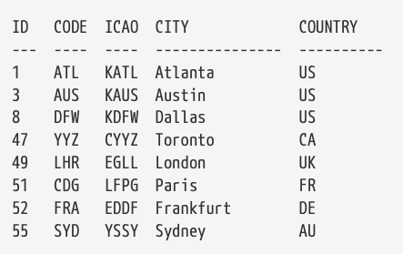

# Gremlin and SQL

**SQL Table**
- Airport table by country



SQL query to count the distribution of airports in each country as follows.
```sql
select country,count(country) from airports group by country;
```

We can do this in Gremlin using the air-routes graph
```gremlin
g.V().hasLabel('airport').groupCount().by('country')
```

- Air routes table
Graph databases are usually a good choice for storing and modelling networks. The air-routes graph is an example of a network graph.
```text
SRC  DEST  DIST
  ---  ----  ----
  ATL  DFW   729
  ATL  FRA   4600
  AUS  DFW   190
  AUS  LHR   4901
  BOM  AGR   644
  BOM  LHR   4479
  CDG  DFW   4933
  CDG  FRA   278
  CDG  LHR   216
  DFW  FRA   5127
  DFW  LHR   4736
  LHR  BOM   4479
  LHR  FRA   406
  YYZ  FRA   3938
  YYZ  LHR   3544
```
If we wanted to write a SQL query to calculate the ways of travelling from Austin (AUS) to Agra (AGR) with two stops, we would end up writing a query that looked something like this:
```sql
select a1.code,r1.dest,r2.dest,r3.dest from airports a1
    join routes r1 on a1.code=r1.src
    join routes r2 on r1.dest=r2.src
    join routes r3 on r2.dest=r3.src
where a1.code='AUS' and r3.dest='AGR';
```

Using our air-routes graph database the query can be expressed quite simply as follows:
```gremlin
g.V().has('code','AUS').out().out().out().has('code','AGR').path().by('code')
```

We could use repeat to express the concept of three times as follows. Gremlin also has a repeat ... until construct
```gremlin
g.V().has('code','AUS').repeat(out()).times(3).has('code','AGR').path().by('code')
```
