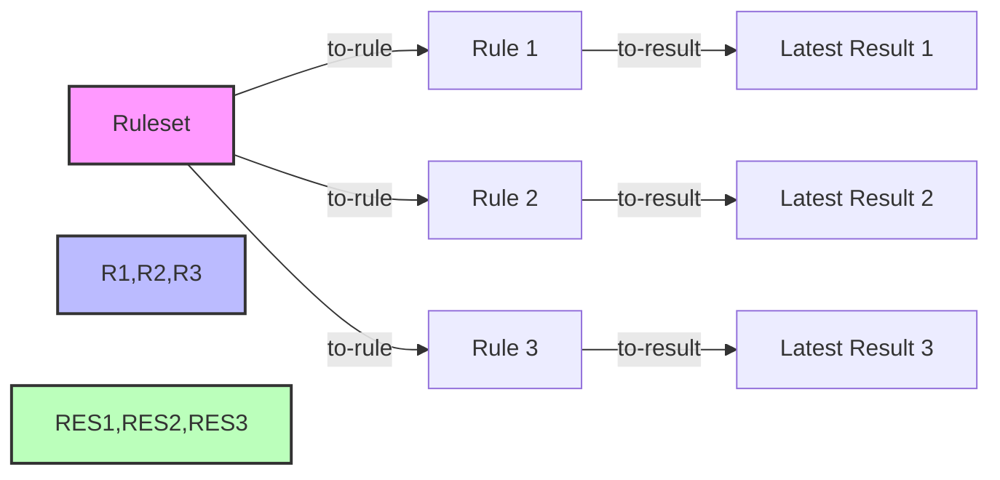

## Problem
- 1 Ruleset Node --- 1 to  N --> Rule Nodes
- and each of the 1 to N Rule Node  matches the latest Result
**Query Result** 
- 1 Ruleset --to-rule--> Rule --to-result--> Result(Latest)

```mermaid
graph LR
    R[Ruleset] -->|to-rule| R1[Rule 1]
    R -->|to-rule| R2[Rule 2]
    R -->|to-rule| R3[Rule 3]
    R1 -->|to-result| RES1[Latest Result 1]
    R2 -->|to-result| RES2[Latest Result 2]
    R3 -->|to-result| RES3[Latest Result 3]
    
    style R fill:#f9f,stroke:#333,stroke-width:2px
    style R1,R2,R3 fill:#bbf,stroke:#333,stroke-width:2px
    style RES1,RES2,RES3 fill:#bfb,stroke:#333,stroke-width:2px

```
